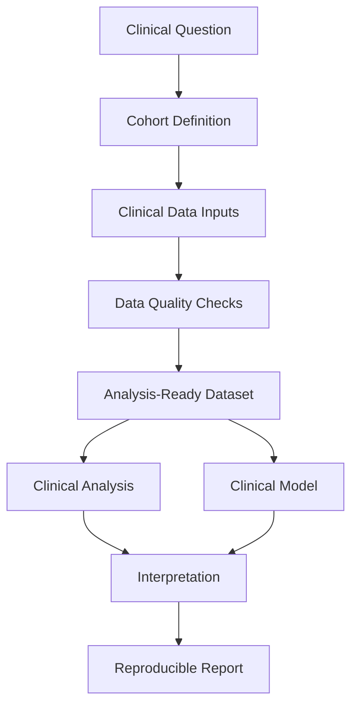

# Clinical & Medical Data Systems

**From Healthcare Records to Reliable Clinical Insights**

This repository is part of the Complex Data Insights pathway system.

## Purpose

Clinical and medical data require careful handling before they can support analysis, modeling, interpretation, or decision support.

This project provides a reproducible teaching and workflow system for:

- clinical questions and cohort definition
- patient demographics and encounters
- diagnoses, procedures, medications, labs, vitals, and outcomes
- data quality checks
- missingness and completeness summaries
- variable engineering
- analysis-ready datasets
- descriptive clinical analysis
- risk stratification and model evaluation
- clinical interpretation and reporting

## Design Pattern

Quarto chapters explain the workflow.

Runnable code lives in:

```text
scripts/bash/
scripts/R/
scripts/python/
```

## Workflow



## Render

```bash
quarto render
```

## Create Example Data

```bash
bash scripts/bash/01-create-example-clinical-data.sh
```

## Run End-to-End Case Study

```bash
bash scripts/bash/20-end-to-end-case-study.sh
```
